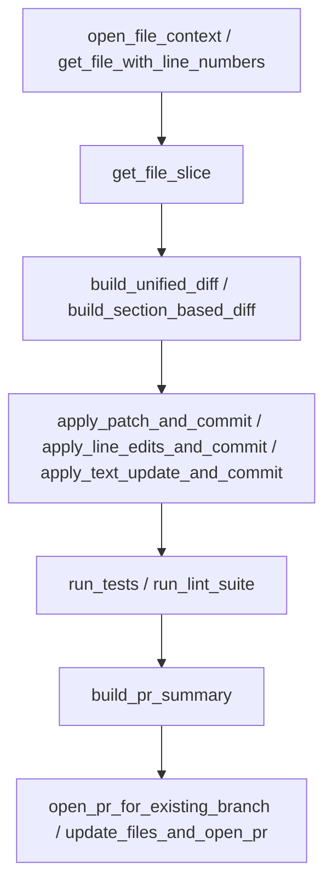
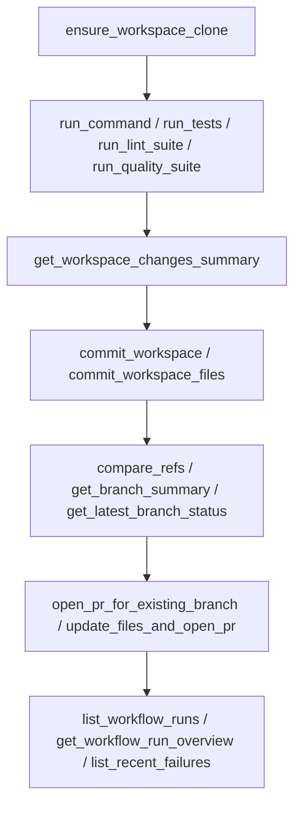
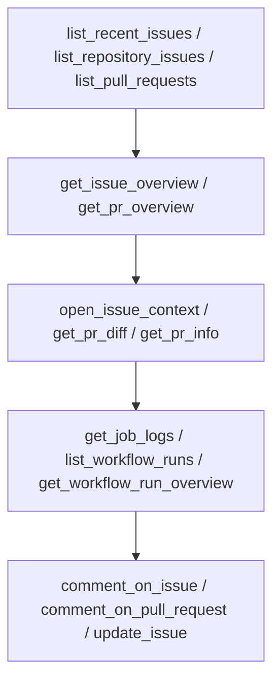

# Detailed MCP tools reference

> Note: This file is intended to be generated or updated from the live tool catalog via `list_all_actions(include_parameters=true, compact=false)`. If new tools are added or schemas change, regenerate or update this document to match the server.
>
> This document also shows how tools fit into the branch–diff–test–PR workflow so controllers and assistants can reason about full flows, not just single calls.

---

## High-level flows

### File-editing flow (slice → diff → commit → PR)

This is the recommended pattern for most edits: fetch a focused view, compute a diff, apply a commit helper, validate with tests/linters, then open or update a PR.

### Workspace and CI flow

Use this when you need a persistent clone for project scripts, refactors, or CI debugging.

### Issue and PR triage flow

Use these tools to understand existing issues/PRs and their CI state before deciding what code changes to make.

---

## Table of contents
- [apply_line_edits_and_commit](#apply_line_edits_and_commit)
- [apply_patch_and_commit](#apply_patch_and_commit)
- [apply_text_update_and_commit](#apply_text_update_and_commit)
- [authorize_write_actions](#authorize_write_actions)
- [build_pr_summary](#build_pr_summary)
- [build_section_based_diff](#build_section_based_diff)
- [build_unified_diff](#build_unified_diff)
- [build_unified_diff_from_strings](#build_unified_diff_from_strings)
- [close_pull_request](#close_pull_request)
- [comment_on_issue](#comment_on_issue)
- [comment_on_pull_request](#comment_on_pull_request)
- [commit_workspace](#commit_workspace)
- [commit_workspace_files](#commit_workspace_files)
- [compare_refs](#compare_refs)
- [controller_contract](#controller_contract)
- [create_branch](#create_branch)
- [create_file](#create_file)
- [create_issue](#create_issue)
- [create_pull_request](#create_pull_request)
- [delete_file](#delete_file)
- [describe_tool](#describe_tool)
- [download_user_content](#download_user_content)
- [ensure_branch](#ensure_branch)
- [ensure_workspace_clone](#ensure_workspace_clone)
- [fetch_files](#fetch_files)
- [fetch_issue](#fetch_issue)
- [fetch_issue_comments](#fetch_issue_comments)
- [fetch_pr](#fetch_pr)
- [fetch_pr_comments](#fetch_pr_comments)
- [fetch_pr_patch](#fetch_pr_patch)
- [fetch_url](#fetch_url)
- [get_branch_summary](#get_branch_summary)
- [get_commit_combined_status](#get_commit_combined_status)
- [get_file_contents](#get_file_contents)
- [get_file_slice](#get_file_slice)
- [get_file_with_line_numbers](#get_file_with_line_numbers)
- [get_issue_comment_reactions](#get_issue_comment_reactions)
- [get_issue_overview](#get_issue_overview)
- [get_job_logs](#get_job_logs)
- [get_latest_branch_status](#get_latest_branch_status)
- [get_pr_diff](#get_pr_diff)
- [get_pr_info](#get_pr_info)
- [get_pr_overview](#get_pr_overview)
- [get_pr_reactions](#get_pr_reactions)
- [get_pr_review_comment_reactions](#get_pr_review_comment_reactions)
- [get_rate_limit](#get_rate_limit)
- [get_repo_dashboard](#get_repo_dashboard)
- [get_repo_defaults](#get_repo_defaults)
- [get_repository](#get_repository)
- [get_server_config](#get_server_config)
- [get_user_login](#get_user_login)
- [get_workflow_run](#get_workflow_run)
- [get_workflow_run_overview](#get_workflow_run_overview)
- [get_workspace_changes_summary](#get_workspace_changes_summary)
- [graphql_query](#graphql_query)
- [list_all_actions](#list_all_actions)
- [list_branches](#list_branches)
- [list_pr_changed_filenames](#list_pr_changed_filenames)
- [list_pull_requests](#list_pull_requests)
- [list_recent_failures](#list_recent_failures)
- [list_recent_issues](#list_recent_issues)
- [list_repositories](#list_repositories)
- [list_repositories_by_installation](#list_repositories_by_installation)
- [list_repository_issues](#list_repository_issues)
- [list_repository_tree](#list_repository_tree)
- [list_workflow_run_jobs](#list_workflow_run_jobs)
- [list_workflow_runs](#list_workflow_runs)
- [list_write_tools](#list_write_tools)
- [merge_pull_request](#merge_pull_request)
- [move_file](#move_file)
- [open_file_context](#open_file_context)
- [open_issue_context](#open_issue_context)
- [open_pr_for_existing_branch](#open_pr_for_existing_branch)
- [ping_extensions](#ping_extensions)
- [pr_smoke_test](#pr_smoke_test)
- [recent_prs_for_branch](#recent_prs_for_branch)
- [resolve_handle](#resolve_handle)
- [run_command](#run_command)
- [run_lint_suite](#run_lint_suite)
- [run_quality_suite](#run_quality_suite)
- [run_tests](#run_tests)
- [search](#search)
- [trigger_and_wait_for_workflow](#trigger_and_wait_for_workflow)
- [trigger_workflow_dispatch](#trigger_workflow_dispatch)
- [update_file_from_workspace](#update_file_from_workspace)
- [update_file_sections_and_commit](#update_file_sections_and_commit)
- [update_files_and_open_pr](#update_files_and_open_pr)
- [update_issue](#update_issue)
- [validate_environment](#validate_environment)
- [validate_json_string](#validate_json_string)
- [validate_tool_args](#validate_tool_args)
- [wait_for_workflow_run](#wait_for_workflow_run)

---

## Tool details

Each section below describes what the tool does, how it is typically used in workflows, and any important constraints or gotchas. The descriptions are written for assistants and controllers who already understand the overall branch–diff–test–PR flow from `controller_contract`.

### apply_line_edits_and_commit

Apply minimal line-based edits to a file and commit them without sending the entire file content. You provide one or more sections with `start_line`, `end_line`, and replacement text; the server fetches the latest file from GitHub, applies the edits, commits to the target branch, and re-reads for verification. Use this when you know the exact line ranges to update and want a compact diff without hand-building unified patches.

### apply_patch_and_commit

Apply a unified diff to a single file, commit it, and then verify the result. The patch should be a standard unified diff for that path, usually generated by `build_unified_diff` against the same branch. This is ideal when you want full control over the patch content or when edits span many locations in one file.

### apply_text_update_and_commit

Replace the full contents of a single file with new text on a branch, then verify that the change landed and optionally return a computed diff. This is useful when the new file content is easier to reason about as a whole (for example, regenerating a small module or documentation page) and the file is not so large that a full-body update would be unwieldy.

### authorize_write_actions

Toggle whether tools marked `write_action=true` are allowed for this MCP session. Controllers can use this to gate risky operations while still permitting read-only discovery and workspace setup tools.

### build_pr_summary

Construct a normalized pull request title/body and status summary for a branch. Use this before calling `open_pr_for_existing_branch` or `update_files_and_open_pr` so PR descriptions stay consistent and include tests/lint information.

### build_section_based_diff

Generate a unified diff from a list of sections (`start_line`, `end_line`, `new_text`) without committing. This is the diff-only counterpart to `apply_line_edits_and_commit` and is useful when you want to inspect or manually apply the patch.

### build_unified_diff

Build a unified diff between the current file contents in GitHub and proposed `new_content`. Use this to preview changes or to feed `apply_patch_and_commit`.

### build_unified_diff_from_strings

Produce a unified diff from explicit `original` and `updated` strings. This avoids extra network reads when you already have both versions in memory.

### close_pull_request

Close an open pull request without merging. Use this when work is abandoned, replaced, or migrated to another branch.

### comment_on_issue

Post a top-level comment on an issue. Use this for progress updates, clarifying questions, or linking related PRs.

### comment_on_pull_request

Post a general (non-review) comment on a pull request. Use this for status notes, high-level feedback, or linking follow-up work.

### commit_workspace

Create a commit from the current state of the persistent workspace and optionally push it. Use this when many files changed and you want a broad commit (for example after a formatter or refactor run).

### commit_workspace_files

Commit a specific set of files from the workspace and optionally push them. Use this for targeted commits that only include the files you specify.

### compare_refs

Compare two refs (base/head) using the GitHub compare API. This returns summaries of commits and file changes and is useful for answering "what changed between these refs?".

### controller_contract

Return the structured contract that governs how assistants and controllers should use this MCP server. Treat this as the source of truth for flows, expectations, and guardrails.

### create_branch

Create a new branch from an existing ref (typically the default branch). Use this once per task so changes stay isolated from `main`.

### create_file

Create a new text file in a repository. The tool performs a preflight read to ensure the target path does not already exist, then commits and re-reads for verification.

### create_issue

Open a new GitHub issue in a repository. Use this to track bugs, tech debt, or follow-up tasks discovered while working.

### create_pull_request

Create a pull request from `head` into `base` using the low-level API. For idempotent PR opening on an existing branch, prefer `open_pr_for_existing_branch`.

### delete_file

Delete a file from a branch using the GitHub contents API. Ensure you are on a dedicated feature branch before deleting so the change is reviewable.

### describe_tool

Return detailed metadata for one or more MCP tools, including parameter schemas. Use this when you need to understand a tool beyond what `list_all_actions` shows.

### download_user_content

Download user-attached content (files, URLs) into the MCP environment with base64 encoding. Use this to bring external artifacts into the workspace or GitHub.

### ensure_branch

Idempotently ensure a branch exists, creating it from a base ref when needed. This is the safest way for assistants to create or reuse feature branches.

### ensure_workspace_clone

Ensure there is a persistent local clone for a repo/ref. All workspace commands (`run_command`, `run_tests`, `run_lint_suite`, `run_quality_suite`) operate on this clone.

### fetch_files

Fetch multiple files in one call, with per-file success or error reporting. This is more efficient than many individual `get_file_contents` calls.

### fetch_issue

Return the raw GitHub issue object for a given issue number. Use this for low-level integrations when `get_issue_overview` is not specific enough.

### fetch_issue_comments

List all comments on an issue. Combine this with `get_issue_comment_reactions` to understand which threads are most active.

### fetch_pr

Return the raw pull request object. This includes metadata such as state, mergeability, and branch names.

### fetch_pr_comments

List top-level comments on a pull request. This does not include review comments tied to specific lines.

### fetch_pr_patch

Return the raw unified diff for a pull request. Use this for custom analysis or tooling that expects patch text.

### fetch_url

Fetch an arbitrary HTTP/HTTPS URL via the shared external client. This is useful for reading external documentation or APIs during a session.

### get_branch_summary

Summarize how a branch compares to its base: ahead/behind counts, open PRs, and recent workflow runs. This is useful for deciding whether to rebase or open a PR.

### get_commit_combined_status

Return the combined GitHub status (success, failure, pending) for a commit. Use this when you care about the overall CI result instead of individual checks.

### get_file_contents

Fetch the full UTF-8 contents of a single file at a ref. Prefer `get_file_slice` or `get_file_with_line_numbers` for large files to avoid huge payloads.

### get_file_slice

Fetch a range of lines from a file. Use this for large files where you only need a specific section for inspection or editing.

### get_file_with_line_numbers

Fetch a segment of a file annotated with line numbers. Use this when planning line-based edits or when you want to reference specific lines in summaries.

### get_issue_comment_reactions

Return reactions for a particular issue comment. Use this to see which comments have the most engagement.

### get_issue_overview

Return a compact, assistant-friendly summary of an issue, including key metadata and cross-links. This is the recommended entry point before doing work related to an issue.

### get_job_logs

Fetch full logs for a specific GitHub Actions job. Combine this with `list_workflow_run_jobs` or `get_workflow_run_overview` to pick the right job.

### get_latest_branch_status

Return the latest CI and PR status for a branch. This builds on `get_branch_summary` and is designed for quick branch health checks.

### get_pr_diff

Return a unified diff for a pull request. Use this when performing code review or summarizing changes.

### get_pr_info

Return metadata about a pull request without diffs. Use this when you only need high-level information.

### get_pr_overview

Return a structured summary of a pull request, including files, CI status, and key metadata. This is the recommended entry point for understanding a PR.

### get_pr_reactions

Return reactions attached to a pull request. Use this to gauge interest or review signals.

### get_pr_review_comment_reactions

Return reactions for review comments on a pull request. Use this to identify important review threads.

### get_rate_limit

Return the current GitHub API rate-limit document for the authenticated token. Use this to debug throttling or unexpected 403 responses.

### get_repo_dashboard

Return a compact dashboard for a repository, including recent issues, PRs, workflow runs, and a top-level tree listing. This is useful as a starting point when exploring a new repo.

### get_repo_defaults

Return connector-specific defaults for repositories, such as the default owner/repo and branch. Controllers can use this to avoid hard-coding values.

### get_repository

Return the standard GitHub repository object, including topics, permissions, and default branch. Use this for repo-level decisions.

### get_server_config

Return a safe summary of MCP server and connector settings, including default repo, default branch, and whether writes are allowed. Run this at the start of each session.

### get_user_login

Return the GitHub login for the authenticated user or app installation. Use this when constructing filters that include `user:branch` style selectors.

### get_workflow_run

Return the raw workflow run object for a GitHub Actions run. Use this when you need detailed status beyond the overview.

### get_workflow_run_overview

Return a compact summary of a workflow run, including status, conclusion, and key metadata. This is suitable for high-level CI triage.

### get_workspace_changes_summary

Summarize modified, added, deleted, and untracked files in the workspace clone. Use this after running `run_command` or tests to see what changed before committing.

### graphql_query

Execute a GitHub GraphQL query using a shared HTTP client and logging wrapper. Use this for advanced scenarios where REST-based tools are insufficient.

### list_all_actions

List all MCP tools exposed by this server, including their basic metadata and write flags. Use this to discover capabilities at the start of a session.

### list_branches

List branches for a repository. Use this to discover existing feature branches or to check that a branch exists before using it.

### list_pr_changed_filenames

List the files changed in a pull request. Use this when you want to know which files to inspect or summarize.

### list_pull_requests

List pull requests for a repository with optional filters by state, base, or head. Use this for PR triage dashboards or to find existing work.

### list_recent_failures

List recent workflow runs that did not succeed. Use this to find flaky tests or persistent CI issues.

### list_recent_issues

List recent issues (and PRs) across repositories accessible to the token. Use this as a starting point for issue triage.

### list_repositories

List repositories accessible to the authenticated user or installation. Use this when you need to choose a repo before deeper exploration.

### list_repositories_by_installation

List repositories for a specific GitHub App installation. Use this when you need to scope work to a particular installation context.

### list_repository_issues

List issues for a single repository with filters (state, labels, etc.). Use this for focused issue triage.

### list_repository_tree

List files and directories in a repository tree, optionally under a path prefix. Use this instead of shell `find` to understand project layout.

### list_workflow_run_jobs

List jobs for a specific workflow run. Use this before fetching job logs.

### list_workflow_runs

List recent workflow runs for a repository, with optional filters. Use this to find the run corresponding to a push or PR.

### list_write_tools

List only the tools that perform writes to GitHub or the workspace. Use this when gating writes via `authorize_write_actions`.

### merge_pull_request

Merge a pull request using a chosen strategy (for example squash). Use this only after CI is green and reviews are complete.

### move_file

Move or rename a file within a repository on a branch. Under the hood this reads the old path, writes the new path, and deletes the old one in a single commit.

### open_file_context

Return a citation-friendly slice of a file with line numbers, wrapping `get_file_slice`. Use this when summarizing or reviewing code.

### open_issue_context

Return an issue plus related branches and pull requests. Use this for "what work exists for this issue?" questions.

### open_pr_for_existing_branch

Open (or reuse) a pull request for an existing branch into a base branch. If a PR already exists for the pair, it is returned instead of creating a duplicate.

### ping_extensions

Ping the MCP server to verify that extensions are reachable. Use this as a health check.

### pr_smoke_test

Create a trivial branch, make a small change, and open a draft PR. Use this to verify that PR workflows are wired correctly.

### recent_prs_for_branch

List recent pull requests associated with a branch, grouped by state. Use this to see whether a branch already has an open PR.

### resolve_handle

Resolve a lightweight handle (like `#123` or `pr:45`) into a concrete issue, PR, or branch reference. Use this to understand shorthand the user provides.

### run_command

Run a shell command inside the persistent workspace clone. Use this for tests, linters, formatters, build tools, search commands, and one-off diagnostics that need the real tree.

### run_lint_suite

Run the project's configured lint suite (for example `ruff`, `flake8`, or equivalent) inside the workspace. Use this before opening a PR to catch style and static-analysis issues.

### run_quality_suite

Run additional quality checks beyond unit tests and linters (for example type checks or integration suites) using project-specific commands.

### run_tests

Run the project's test suite inside the workspace. Use this after code changes and before opening PRs.

### search

Perform GitHub search queries (code, issues, PRs, and more). For work on this controller repo, prefer repo-scoped queries that include `repo:Proofgate-Revocations/chatgpt-mcp-github`.

### trigger_and_wait_for_workflow

Trigger a GitHub Actions workflow and poll until it completes or times out. Use this when you need to run a workflow on demand and wait for the result.

### trigger_workflow_dispatch

Trigger a GitHub Actions workflow dispatch event for a workflow and ref without waiting for completion. Use this when you want to start CI but do not need to block on it.

### update_file_from_workspace

Update a file in GitHub from the corresponding file in the workspace clone. Use this when you edited files via `run_command` and now want to sync them back to the branch.

### update_file_sections_and_commit

Update a file by applying section-based replacements and committing in one step. This combines diff construction and commit application for line-based edits.

### update_files_and_open_pr

Commit one or more files, verify them, and open a pull request in one call. Use this for small, focused changes where you want a turnkey commit+PR helper.

### update_issue

Update an existing issue's title, body, state, labels, or assignees. Use this to keep issue metadata aligned with the current plan.

### validate_environment

Validate the MCP server's GitHub environment (tokens, permissions, defaults). Use this to debug configuration problems or unexpected failures.

### validate_json_string

Validate whether a string is valid JSON and return parse errors if not. Use this before handing JSON payloads to other tools.

### validate_tool_args

Validate candidate tool arguments against the live JSON schema without running the tool. Use this as a preflight check for write or complex tools.

### wait_for_workflow_run

Poll a workflow run until it reaches a terminal state or a timeout. Use this after triggering workflows when you need to know the final result.
