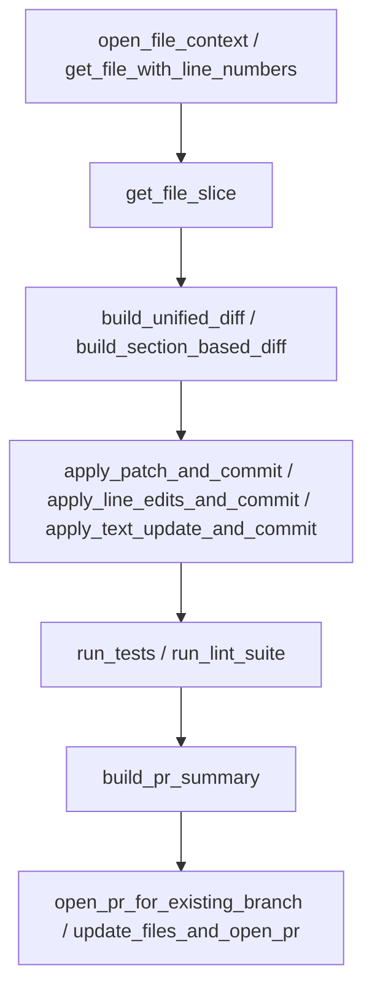
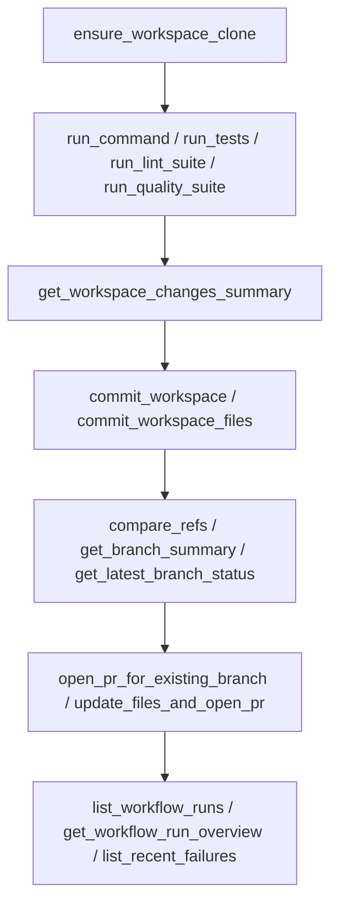
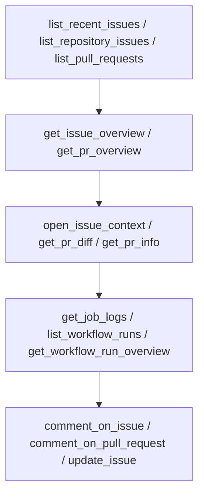

# Detailed MCP tools reference

> Note: This file is intended to be generated or updated from the live tool catalog via `list_all_actions(include_parameters=true, compact=false)`. If new tools are added or schemas change, regenerate or update this document to match the server.
>
> This document also shows how tools fit into the branch–diff–test–PR workflow so controllers and assistants can reason about full flows, not just single calls.

---

## High-level flows

### File-editing flow (slice → diff → commit → PR)

This is the recommended pattern for most edits: fetch a focused view, compute a diff, apply a commit helper, validate with tests/linters, then open or update a PR.

### Workspace and CI flow

Use this when you need a persistent clone for project scripts, refactors, or CI debugging.

### Issue and PR triage flow

Use these tools to understand existing issues/PRs and their CI state before deciding what code changes to make.

---

## Table of contents
- [apply_line_edits_and_commit](#apply_line_edits_and_commit)
- [apply_patch_and_commit](#apply_patch_and_commit)
- [apply_text_update_and_commit](#apply_text_update_and_commit)
- [authorize_write_actions](#authorize_write_actions)
- [build_pr_summary](#build_pr_summary)
- [build_section_based_diff](#build_section_based_diff)
- [build_unified_diff](#build_unified_diff)
- [build_unified_diff_from_strings](#build_unified_diff_from_strings)
- [close_pull_request](#close_pull_request)
- [comment_on_issue](#comment_on_issue)
- [comment_on_pull_request](#comment_on_pull_request)
- [commit_workspace](#commit_workspace)
- [commit_workspace_files](#commit_workspace_files)
- [compare_refs](#compare_refs)
- [controller_contract](#controller_contract)
- [create_branch](#create_branch)
- [create_file](#create_file)
- [create_issue](#create_issue)
- [create_pull_request](#create_pull_request)
- [delete_file](#delete_file)
- [describe_tool](#describe_tool)
- [download_user_content](#download_user_content)
- [ensure_branch](#ensure_branch)
- [ensure_workspace_clone](#ensure_workspace_clone)
- [fetch_files](#fetch_files)
- [fetch_issue](#fetch_issue)
- [fetch_issue_comments](#fetch_issue_comments)
- [fetch_pr](#fetch_pr)
- [fetch_pr_comments](#fetch_pr_comments)
- [fetch_pr_patch](#fetch_pr_patch)
- [fetch_url](#fetch_url)
- [get_branch_summary](#get_branch_summary)
- [get_commit_combined_status](#get_commit_combined_status)
- [get_file_contents](#get_file_contents)
- [get_file_slice](#get_file_slice)
- [get_file_with_line_numbers](#get_file_with_line_numbers)
- [get_issue_comment_reactions](#get_issue_comment_reactions)
- [get_issue_overview](#get_issue_overview)
- [get_job_logs](#get_job_logs)
- [get_latest_branch_status](#get_latest_branch_status)
- [get_pr_diff](#get_pr_diff)
- [get_pr_info](#get_pr_info)
- [get_pr_overview](#get_pr_overview)
- [get_pr_reactions](#get_pr_reactions)
- [get_pr_review_comment_reactions](#get_pr_review_comment_reactions)
- [get_rate_limit](#get_rate_limit)
- [get_repo_dashboard](#get_repo_dashboard)
- [get_repo_defaults](#get_repo_defaults)
- [get_repository](#get_repository)
- [get_server_config](#get_server_config)
- [get_user_login](#get_user_login)
- [get_workflow_run](#get_workflow_run)
- [get_workflow_run_overview](#get_workflow_run_overview)
- [get_workspace_changes_summary](#get_workspace_changes_summary)
- [graphql_query](#graphql_query)
- [list_all_actions](#list_all_actions)
- [list_branches](#list_branches)
- [list_pr_changed_filenames](#list_pr_changed_filenames)
- [list_pull_requests](#list_pull_requests)
- [list_recent_failures](#list_recent_failures)
- [list_recent_issues](#list_recent_issues)
- [list_repositories](#list_repositories)
- [list_repositories_by_installation](#list_repositories_by_installation)
- [list_repository_issues](#list_repository_issues)
- [list_repository_tree](#list_repository_tree)
- [list_workflow_run_jobs](#list_workflow_run_jobs)
- [list_workflow_runs](#list_workflow_runs)
- [list_write_tools](#list_write_tools)
- [merge_pull_request](#merge_pull_request)
- [move_file](#move_file)
- [open_file_context](#open_file_context)
- [open_issue_context](#open_issue_context)
- [open_pr_for_existing_branch](#open_pr_for_existing_branch)
- [ping_extensions](#ping_extensions)
- [pr_smoke_test](#pr_smoke_test)
- [recent_prs_for_branch](#recent_prs_for_branch)
- [resolve_handle](#resolve_handle)
- [run_command](#run_command)
- [run_lint_suite](#run_lint_suite)
- [run_quality_suite](#run_quality_suite)
- [run_tests](#run_tests)
- [search](#search)
- [trigger_and_wait_for_workflow](#trigger_and_wait_for_workflow)
- [trigger_workflow_dispatch](#trigger_workflow_dispatch)
- [update_file_from_workspace](#update_file_from_workspace)
- [update_file_sections_and_commit](#update_file_sections_and_commit)
- [update_files_and_open_pr](#update_files_and_open_pr)
- [update_issue](#update_issue)
- [validate_environment](#validate_environment)
- [validate_json_string](#validate_json_string)
- [validate_tool_args](#validate_tool_args)
- [wait_for_workflow_run](#wait_for_workflow_run)

## Tool details

Each section below describes what the tool does, how it is typically used in workflows, and any important constraints or gotchas. The descriptions are written for assistants and controllers who already understand the overall branch–diff–test–PR flow from `controller_contract`.

### apply_line_edits_and_commit

Apply minimal line-based edits to a file and commit them without sending the entire file content. You provide one or more sections with `start_line`, `end_line`, and replacement text; the server fetches the latest file from GitHub, applies the edits, commits to the target branch, and re-reads for verification. Use this when you know the exact line ranges to update and want a compact diff without hand-building unified patches.

### apply_patch_and_commit

Apply a unified diff to a single file, commit it, and then verify the result. The patch should be a standard unified diff for that path, usually generated by `build_unified_diff` against the same branch. This is ideal when you want full control over the patch content or when edits span many locations in one file.

### apply_text_update_and_commit

Replace the full contents of a single file with new text on a branch, then verify that the change landed and optionally return a computed diff. This is useful when the new file content is easier to reason about as a whole (for example, regenerating a small module or documentation page) and the file is not so large that a full-body update would be unwieldy.

### authorize_write_actions

Toggle whether tools marked `write_action=true` are allowed for this MCP session. Controllers can use this to gate risky operations while still permitting read-only discovery and workspace setup tools.
